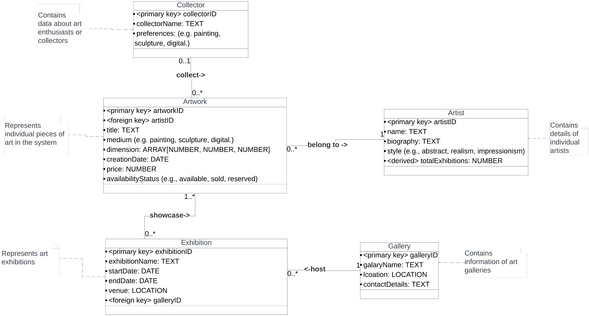
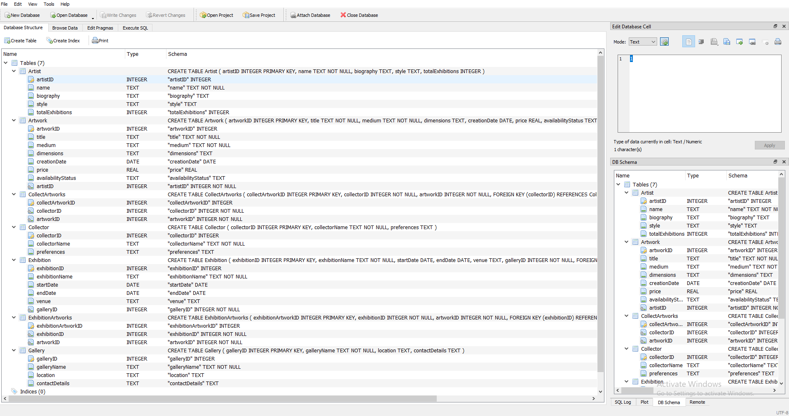

### Art & Artist Management System

This is Project 1 for the Database Management System course.

#### Requirements document

[Requirements document](./requirements.pdf)

#### UML



#### ERD


#### Data definition statements

[`data_definition`](./data_definition.sql)

#### Show that the tables were created and conform to the constraints through screen shots



#### Populate the tables with test data using Mockaroo

The test data are in the [`data_populate.sql`](./data_populate.sql). The database with the test data imported is `db.db`.

#### Five queries

[`query.sql`](./query.sql)

#### Application

```bash
cd app
npm install
npm start
```

on browser: localhost:3000
