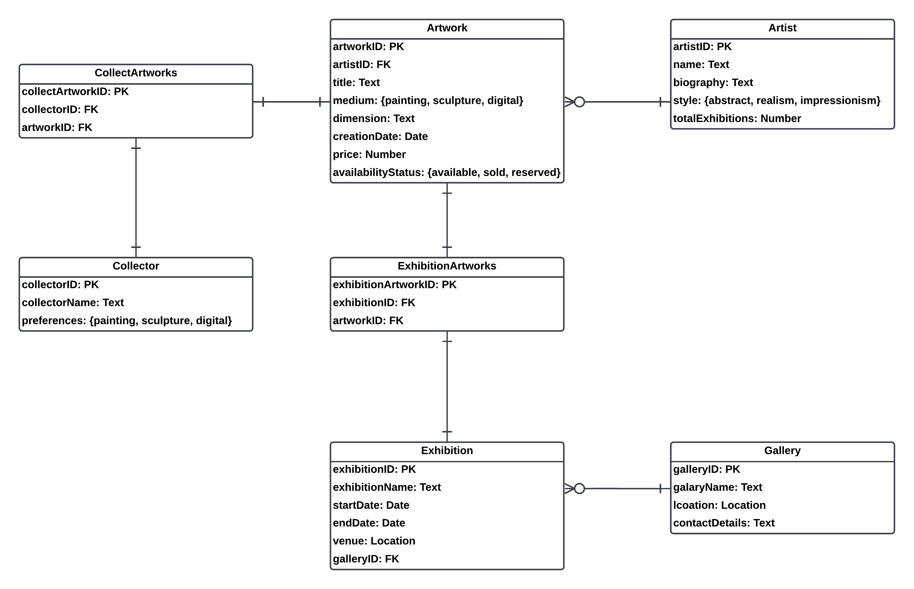

### Art & Artist Management System

This is Project 1 for the Database Management System course.

#### Requirements document

[Requirements document](./requirements.pdf)

#### UML


#### ERD



#### Show that the tables were created and conform to the constraints through screen shots


#### Populate the tables with test data using Mockaroo

The test data are in the `data_populate.sql`. The database with the test data imported is `db.db`.

#### Five queries

1. Join of at least 3 tables: Retrieve all artworks displayed in the exhibition `Modern Perspectives`

```sql
SELECT 
    a.title AS artworkTitle,
    ar.name AS artistName,
    e.exhibitionName 
FROM 
    Artwork a
JOIN 
    ExhibitionArtworks ea ON a.artworkID = ea.artworkID
JOIN 
    Exhibition e ON ea.exhibitionID = e.exhibitionID
JOIN 
    Artist ar ON a.artistID = ar.artistID
WHERE 
    e.ExhibitionName = 'Modern Perspectives';
```

screenshot:


2. Subquery: Find artworks that are priced above the average price of all artworks

```sql
SELECT 
    title,
    price 
FROM 
    Artwork 
WHERE 
    price > (SELECT AVG(price) FROM Artwork);
```

screenshot:


3. GROUP BY with HAVING clause: Find the artists who have more than 2 artworks in the database

```sql
SELECT 
    artistID,
    COUNT(artworkID) AS NumberOfArtworks 
FROM 
    Artwork 
GROUP BY 
    artistID 
HAVING 
    NumberOfArtworks > 2;
```

screenshot:


4. Complex search criterion: Retrieve artworks created after 1/1/2020 that are either paintings priced above $50 or sculptures priced below $20

```sql
SELECT 
    title,
    medium,
    creationDate,
    price 
FROM 
    Artwork 
WHERE 
    creationDate > '2020-01-01' AND 
    ((medium = 'painting' AND price > 50) OR (medium = 'sculpture' AND Price < 20));
```

screenshot:


5. Advanced query mechanisms using `SELECT CASE/WHEN`: Classify artworks based on their price range

```sql
SELECT 
    title,
    price,
    CASE
        WHEN price <= 20 THEN 'Budget'
        WHEN Price > 20 AND Price <= 70 THEN 'Mid-range'
        WHEN Price > 70 THEN 'Premium'
        ELSE 'Unknown'
    END AS priceRange
FROM 
    Artwork;
```

screenshot:


#### Application

```bash
cd app
npm install
npm start
```

on browser: localhost:3000
